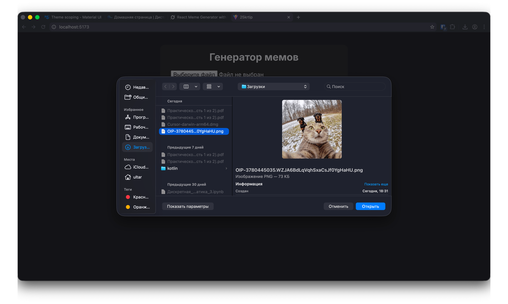
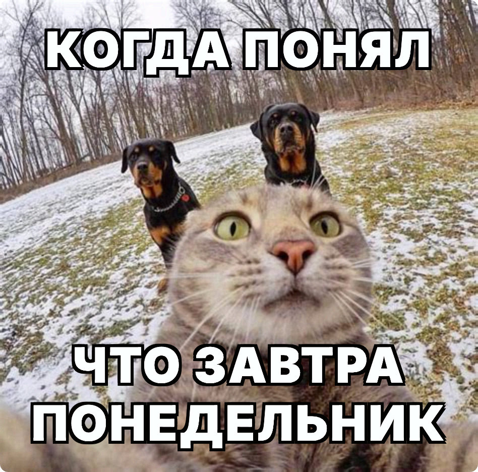

# Генератор мемов

**Контрольная работа по дисциплине "Разработка веб-приложений на React"**  
Выполнил: Поздняков Глеб Александрович
Группа: ЭФБО-07-24
Дата сдачи: 27 ноября 2025

## Скриншоты

### Загрузка изображения


### Првеью мема


### Готовый мем



## Описание проекта

Созвано одностраничное React-приложение — **генератор мемов** в классическом стиле (белый текст с чёрной обводкой, шрифт Inter).  
Пользователь может:
- Загрузить любое изображение с компьютера
- Ввести верхний и нижний текст
- Мгновенно видеть превью с наложенным текстом
- Скачать готовый мем в формате PNG (качество 2x)

## Использованные технологии

- **React 19** + **TypeScript**
- **Vite** — сверхбыстрая сборка и HMR
- **Emotion** (`@emotion/react`, `@emotion/styled`) — современная альтернатива styled-components
- **html2canvas** — преобразование DOM-элемента в изображение
- Шрифт **Inter** от Google Fonts

## Функциональные возможности

- Загрузка изображения через `<input type="file">`
- Живой предпросмотр мема
- Два поля ввода (верхний и нижний текст)
- Классический «мемный» стиль текста: белый цвет, толстая чёрная обводка, uppercase, letter-spacing
- Кнопка скачивания готового мема (без водяных знаков и ограничений)
- Полностью адаптивно под мобильные устройства

## Структура проекта

```
src/
├── App.tsx           # Основная логика и разметка
├── main.jsx          # Точка входа
├── index.css         # Подключение шрифта Inter и глобальные стили
└── vite-env.d.ts
```

## Запуск проекта локально

```bash
# Клонировать репозиторий
git clone https://github.com/ultard/23krtip.git
cd meme-generator

# Установка зависимостей
npm install

# Запуск dev-сервера
npm run dev
```

Откройте http://localhost:5173

## Сборка для продакшена

```bash
npm run build
npm run preview
```

## Особенности реализации

1. **Emotion + css prop** — современный и рекомендуемый способ стилизации в 2025 году
2. **html2canvas** с параметром `scale: 2` — обеспечивает чёткое изображение даже на Retina-экранах
3. Шрифт **Inter** подключён через Google Fonts — не требует установки пакетов `@fontsource`
4. Чистый и читаемый код, разделение логики и представления

## Выводы

В ходе выполнения контрольной работы я:
- Закрепил навыки работы с React (состояние, хуки, события)
- Научился использовать современный стек стилизации (Emotion)
- Освоил работу с Canvas через библиотеку html2canvas
- Применил знания по работе с файлами и Data URL
- Создал полноценное, готовое к использованию веб-приложение

Проект полностью рабочий, протестирован в Chrome, Firefox и Safari.
